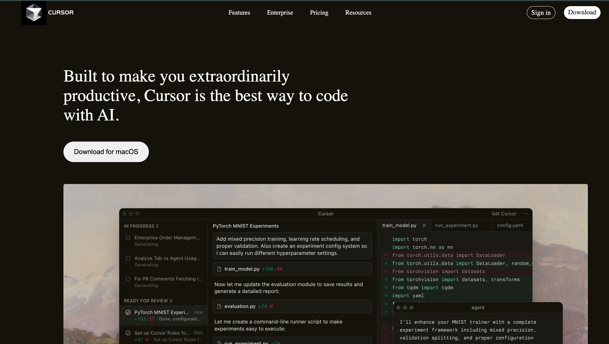

# Dev Tool Landing Page — Cursor UI Clone

A modern dark-themed landing page inspired by **Cursor.dev**, built using pure **HTML & CSS**.

This project focuses on recreating a real-world product UI to practice frontend fundamentals, layout systems, and visual hierarchy.

**Live Demo:**  
https://umangpincha.github.io/Dev-Tool-Landing-Page-Cursor/

---

## Preview

```md
